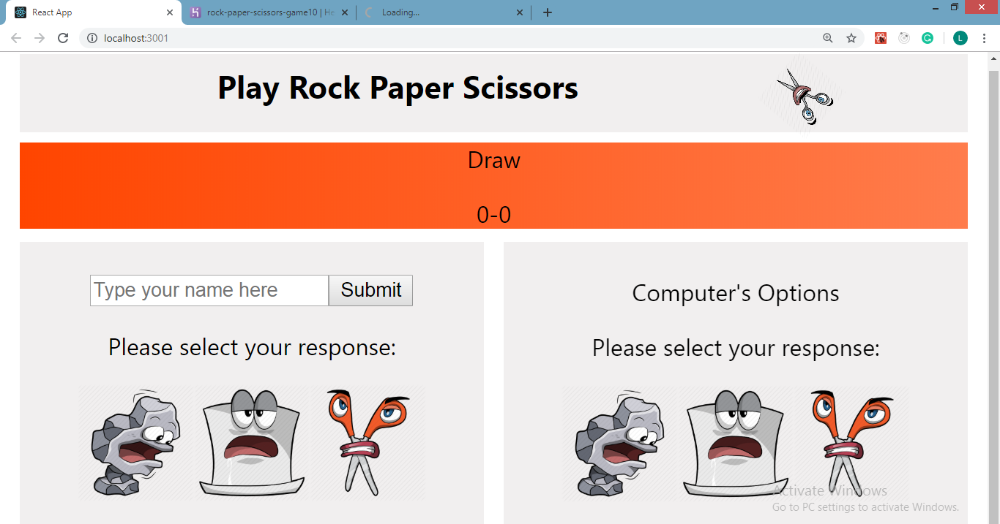
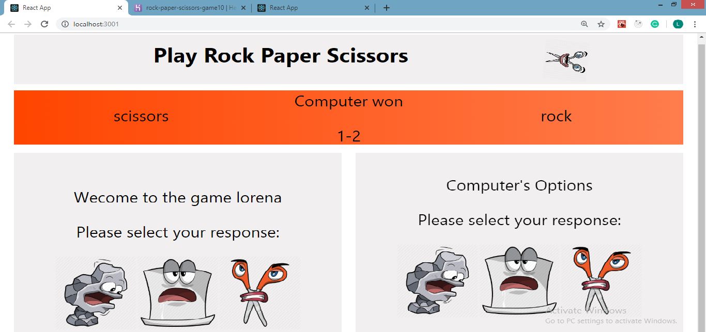
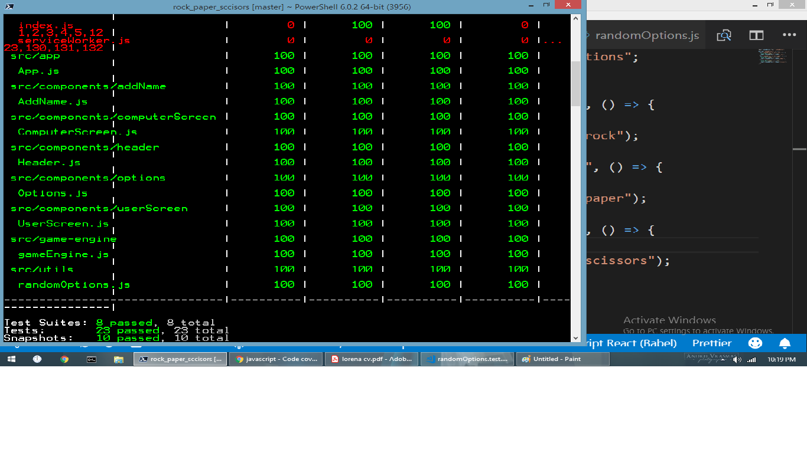

# Rock Paper Scissors

A React game where the user can play the famous Rock Paper Scissors game against the computer. The user can choose his response and at the same time will be selected the computer response. Both responses can be seen on the screen and also the winner will be revealed. The user can play as many games as he wants and the score will be kept. All the components are tested using Jest

## To start the project:

- Install and start the app:

  - `clone the repo`
  - `cd into the folder`
  - `run npm install`
  - `npm start`

## Screenshots

Game before playing:

Game while playing:

Test coverage

#### To see the game online: https://rock-paper-scissors-game10.herokuapp.com/

## Technologies used:

- JavaScript
- React
- Jest
- Styled Components
